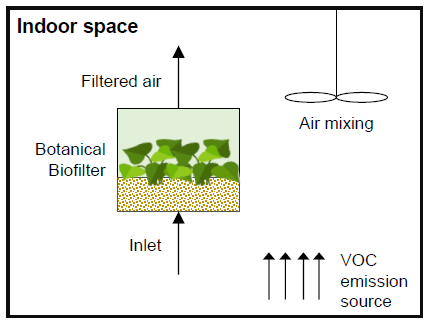
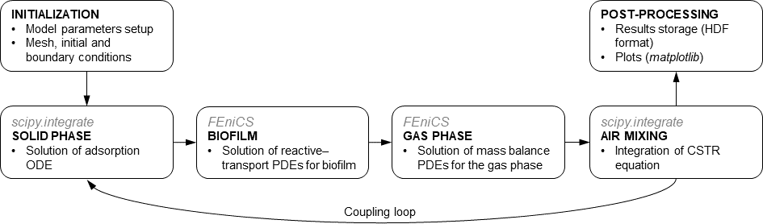

# biofilter-model

## 1D reactive–transport model of (botanical) biofiltration of VOCs

Reference: *Modelling botanical biofiltration of indoor air streams contaminated by volatile organic compounds [[1]](#1)*.

[](https://doi.org/10.1016/j.jhazmat.2021.126875)

Botanical filtration is a biological-based treatment method suitable for removing hazardous volatile organic compounds (VOCs) from air streams, based on forcing an air flow through a porous substrate and foliage of a living botanical compartment. 



The botanical biofilter model of this repository is fully described in Masi et al., 2022 [[1]](#1). The model is numerically implemented in Python programming language and the PDEs are solved using the open-source [FEniCS](https://fenicsproject.org/) computing platform. ODEs are solved with [scipy.integrate](https://docs.scipy.org/doc/scipy/tutorial/integrate.html), a sub-package of [SciPy](https://scipy.org/).
The [Gryphon](https://github.com/skare/gryphon-project) library is used for solving time dependent PDEs in FEniCS using Runge-Kutta ESDIRK method.

Gas phase, biofilm, solid phase and air mixing mass balances are solved separately and coupled using a sequential non-iterative split-operator approach (SNIA), according to the following diagram:



## Usage

The model has been tested with the latest FEniCS (legacy) release (version 2019.1.0). It is not compatible with the newer FEniCSx releases.
FEniCS only runs on Linux natively. Installation instructions are available [here](https://fenicsproject.org/download/archive/). Windows users are advised to use Docker to run the model, as described below.

The parameters for running the simulations are stored as yaml files in the folder `parameters/*.yml`. The folder may contain one or more .yml files.
To run the simulations, just launch the python file `main.py`.

```sh
python3 main.py
```

If more than one .yml file is placed inside the `parameters/` folder, they will run in batch.

The results of the simulations are saved in .h5 files (HDF format) inside the `results/` folder.

## Run with docker

A customized FEniCS Docker image can be easily built using the `Dockerfile` provided in the `docker/` folder.

```sh
cd docker
docker build . --tag bbm/fenics
```

The customized image named `bbm/fenics` is identical to the `quay.io/fenicsproject/stable` image, with the exception of few pip packages that are installed/upgraded (numpy, scipy, pandas, h5py, etc.).

A Docker container with name `fenics-container` can be created with the following command:

```sh
docker run -ti -v $(pwd):/home/fenics/shared --name fenics-container bbm/fenics
```

The option `-v` creates a bind between the current directory on the host machine and the specified directory inside the container.
The current directory variable `$(pwd)` (Linux) can be replaced with `%cd%` in Windows (when using cmd). In Windows, the working directory must not contain spaces in the path.

The following commands can be used to run the simulations:

```sh
docker start fenics-container
docker exec -ti fenics-container bash -c "cd /home/fenics/shared/ && python3 main.py"
docker stop fenics-container
```

## Plotting the results
Inside the `post-processing/` folder there is a script `plots.py` that can be used to plot the results of the simulations:

```sh
cd post-processing/
python3 plots.py
```

A MATLAB version (`plots.m`) is also available in the same folder.

## References

<a id="1">[1]</a> Masi, M., Guidi Nissim, W., Pandolfi, C., Azzarello, E., Mancuso, S. (2022). Modelling botanical biofiltration of indoor air streams contaminated by volatile organic compounds. *Journal of Hazardous Materials*, 422, 126875. DOI: [10.1016/j.jhazmat.2021.126875](https://doi.org/10.1016/j.jhazmat.2021.126875)
